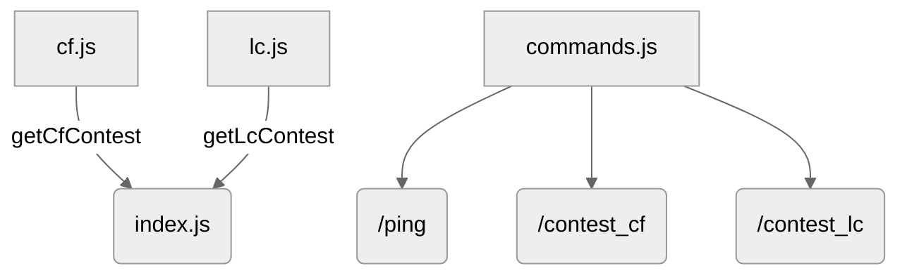

# TLEminder

A Discord bot that tracks competitive programming contests from Codeforces and LeetCode, provides on-demand lists via slash commands, and broadcasts daily updates.

## Project Structure & Flow

- `index.js` receives and manages data objects from both module files.
- `cf.js` provides Codeforces contest data to `index.js`.
- `lc.js` provides LeetCode contest data to `index.js`
- `command.js` registers application commands (`/ping`, `/contest_cf`, `/contest_lc`)

## Flowchart

## Core Behavior

- **Once client is ready**: Fetches and caches upcoming contest data.
- **Once it is 12:00 AM**: Automatically evaluates and prints contest data for the current day (if any exist).

## Commands

- `/ping` -> Returns PONG! to verify that the bot is online and working
- `/contest_cf` -> Returns the list of upcoming Codeforces contests using official API
- `/contest_lc` -> Returns the list of upcoming Leetcode contests using unofficial API

## Purpose of Each File

- `command.js` -> Tells the server about the commands we can use.
- `cf.js` -> Returns an object with upcoming contest names and their date + time for Codeforces.
- `lc.js` -> Same as `cf.js` for Leetcode.
- `index.js` -> Determines the action of each command and determines what messages to send when it turns 12:00.

## API Used

- `Codeforces:` https://codeforces.com/apiHelp
- `Leetcode:` https://github.com/alfaarghya/alfa-leetcode-api
